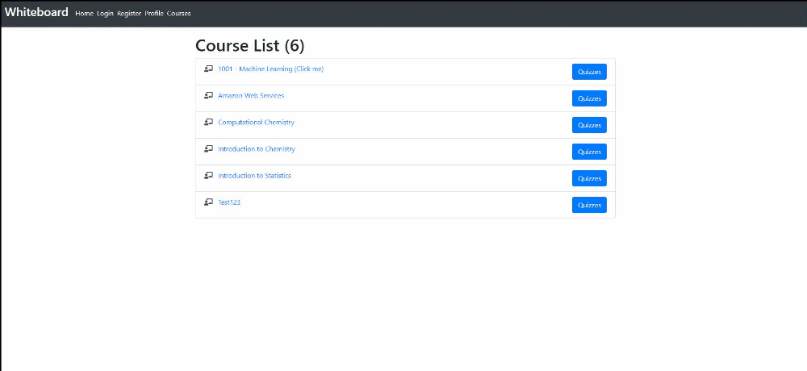

## CS 5610 - Whiteboard Application (Angular)

### Assignments & Updates:

#### Assignment 7: Implementing Component Based Dynamic Web Interfaces with Angular:
- Implementation of the MEAN stack to develop an online Learning Management System (LMS).
- Developed nested routes and components to implement embedded Angular user interfaces.
- Implemented navigation using Angular Routing.
- Integrated the Angular Application with RESTful APIs.
- Deployed the [Angular 7 application](https://cs5610-client-angular-alkhalif.herokuapp.com/) to Heroku.

#### Assignment 8: Implementing RESTful Services API with Node.js and Express:
- Refactored the code to include a services package and a controllers package.
- Data is still being read in via JSON files. This will change in Assignment 9.
- The API was [deployed to Heroku](https://cs5610-node-server-a8.herokuapp.com/quizzes/) and is available online.
- The API is readily utilized by an [Angular 7 application](https://cs5610-client-angular-alkhalif.herokuapp.com/) that renders and grades quizzes.

#### Assignment 9: Persisting Data in Non-Relational Databases with MongoDB and Mongoose
- External API was connected to a non-relational MongoDB database using Mongoose.
- Quizzes component was added for True/False and Multiple Choice which are automatically graded.
- Graded quizzes are posted to the server, and the grade is displayed along with the attempt #.
- The API was [deployed to Heroku](https://cs5610-node-a9-alkhalifas.herokuapp.com/api/quizzes/5fc4098f108a931d54a5a9e4/attempts) and is available online.

